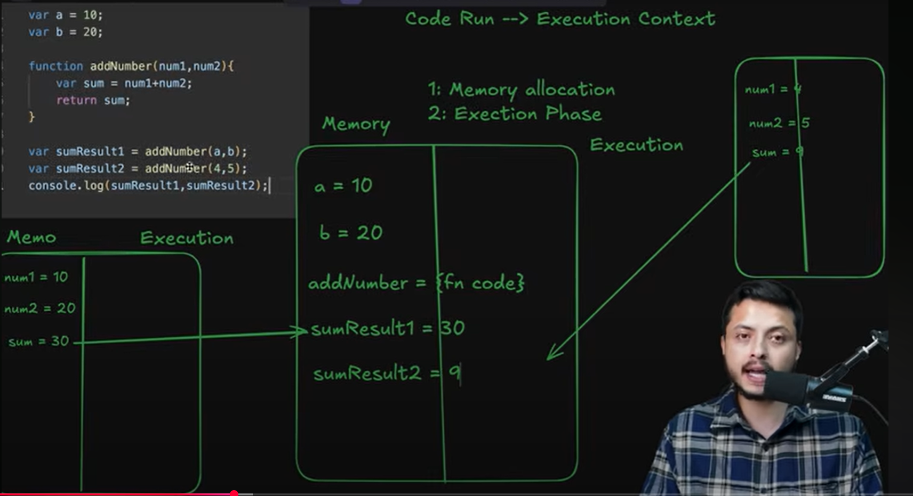
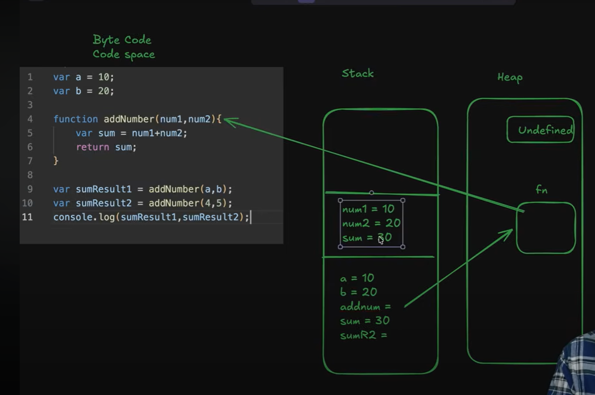

How javascript code runs?
-> Whenever we run code in javascript, a execution context gets created.

What is execition context?
-> It means Javascript code will run in 2 phases:-
    1. Memory Allocation phase
    2: Execution phase

Eg:- 
var a = 10;
var b = 20;

function addNumber(num1, num2){
    var sum = num1+num2;
    return sum;
}

var sumResult1 = addNumber(a,b);
var sumResult2 = addNumber(4,5);
console.log(sumResult1, sumResult2);

GLOBAL EXECUTION CONTEXT
1.Memory allocation phase
-> In this we allocate memory to the variables and functions
-> assign the variables to undefined, and in function variable, the function code is being stored
so,
a = undefined
b = undefined
addNumber = {func code}
sumResult1 = undefined
sumResult2 = undefined

2. Execution phase
-> Javascript will again read the code line by line and assign values to the variables
a =10
b =20
addNumber = {func code}
sumResult1 = function call(function code runs)
so, whenever the code runs -> Execution context is being created. It has two phase Memory allocation phase, and Execution phase.

EXECUTION CONTEXT
Execution Context for function addNumber(a,b)
1. Memory allocation phase
-> It will allocate memory to the function variables
num1 = undefined
num2 = undefined
sum = undefined

2. Execution phase
-> Javascript will again read the code line by line and assign values to the variables
num1 = 10
num2 = 20
sum = 30
After this, it will return this sum to sumResult1

sumResult1 = 30
same happens with sumResult2

Where this things are stored?
1. Stack
2. Heap

-> so in the global execution phase, the variables are being stored in stack and it is pointing to undefined which is stored in heap.
(as undefined and objects are in objects)
-> the function variable stored in stack, and that is pointing to the function which is stored in heap(but in english language)
-> computer only understands the byte code, so when we call that function, it will directly point in the code and the same process will repeat, the variables will get stored in stack memory(new memory), and it will point to the undefined.
-> Once the code will return, the stack memory phase will automatically get deleted.
-> The undefined and the function code which is stored in heap is deleted by the garbage collector

//In let and const, if we want to access the variables and functions before initialization, it will throw error, because before execution phase, the variables and functions are in "temporal dead zone"

What is hoisting?
-> Hoisting is javascript's behavior of knowing about a variable or function existance before the execution phase. This behaviour depends on the keywords(let, var, cost, function, var)