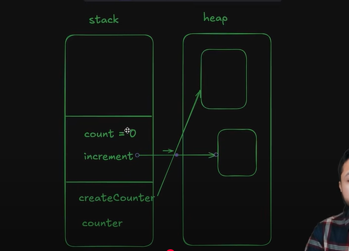
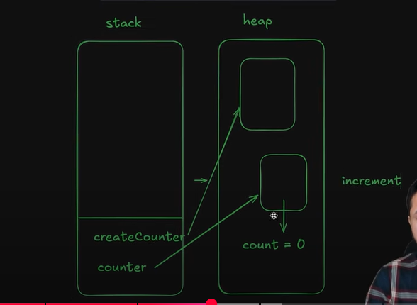

3 types of scopes:-
1. Global Scope => Accessible to everyone
2. Block level Scope => Accessible only to that block
3. Functional Scope => Accessible only to that function

Closure => A function which remembers the variables of its outer scope even after the outer scope function has finished executing.

